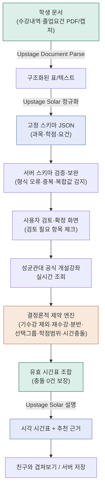

＝＝＝＝＝＝＝＝＝＝＝＝＝＝＝＝＝＝＝＝＝＝＝＝＝＝＝＝＝＝＝＝＝＝＝＝＝＝＝＝＝＝＝＝＝＝
파일명: 09_데모데이_발표_준비.md
역할: `docs/05_미해결_과제.md` P16(공식 데모데이 루브릭 증거 완성)의 실제 산출물.
      `docs/08_데모데이_평가항목_루브릭.md` 5절 체크리스트 10개 항목과 P16 체크리스트 6개
      항목을 하나씩 채운다. 발표 슬라이드/스크립트를 만들 때 이 문서를 그대로 옮기면 된다.
근거: 이 문서의 수치는 전부 `docs/02_기술검증_기록.md`(라이브 API 실측),
      `docs/14_시행착오_기록_발표용.md`(Upstage 전후 반복 호출 실측), 실제 테스트 스위트
      (2026-07-20 기준 210개 통과)에서 그대로 가져온 것이며, 이 문서에서 새로 지어낸 숫자는
      없다. "추정"이라고 표시한 항목만 실측이 아닌 구조적 근거다.
최종 갱신: 2026-07-20
＝＝＝＝＝＝＝＝＝＝＝＝＝＝＝＝＝＝＝＝＝＝＝＝＝＝＝＝＝＝＝＝＝＝＝＝＝＝＝＝＝＝＝＝＝＝

## 0. 발표 논리 흐름 (문제·타겟 → 정보출처 → 처리깊이 → 결과 → 확장성)

발표는 이 순서를 그대로 따라간다 — 각 화살표가 다음 절 번호다.

```
[문제·타겟] 흩어진 학사정보를 매번 손으로 대조해야 하는 성균관대 학부생 (§1)
     ↓
[정보출처] 학생 개인 문서(수강내역·졸업요건) + 성균관대 공식 개설강좌 API (§2)
     ↓
[처리깊이] Document Parse → Solar 정규화 → 서버 검증 → 사용자 확정 → 결정론적 조합 생성 (§3)
     ↓
[결과] 시간 충돌·재수강·학점 범위·개인 제약을 전부 만족하는 시간표만, 근거와 함께 (§4, §5)
     ↓
[확장성] 친구 시간표 겹쳐보기, 서버 저장, AI 추천 가중치 — 같은 파이프라인 위에 계속 얹었다 (§6)
```

---

## 1. 문제와 타겟

- **타겟**: 수강 이력, 졸업요건, 개설강좌, 강의계획서가 흩어져 있어 다음 학기 시간표를 직접
  대조해야 하는 성균관대 학부생.
- **문제**: 이 대조 작업은 단순 검색이 아니라 여러 제약(시간 충돌, 재수강 여부, 학점 범위,
  졸업요건 잔여 영역, 분반)을 동시에 만족하는 조합 문제다. 사람이 손으로 하면 누락되기 쉽고,
  범용 챗봇에 문서를 한 번 넣는 것만으로는 최신 개설강좌·분반·충돌 검증을 보장할 수 없다.

## 2. 정보 출처 — "어디서, 왜 가져오는가"

| 정보 | 출처 | 왜 이 출처인가 |
|---|---|---|
| 수강/취득과목, 졸업요건 | 학생이 GLS에서 직접 발급한 PDF/캡처 | 학교 시스템도 로그인 뒤에만 보이는 개인정보라 학생 본인 업로드가 유일한 경로 (`docs/05` P6에서 자동 크롤링 불가 실측 확인) |
| 개설강좌(과목·분반·시간·학점) | 성균관대 공식 강좌 조회 API 실시간 호출 | 정적 스냅샷은 학기마다 바뀌는 분반·시간을 못 따라감 — 실제로 정적 학과 목록이 22개 누락돼 있었던 사례(§5 참고)가 왜 실시간 조회가 필요한지 보여준다 |
| 학과 목록 | 성균관대 공식 API 실시간 조회, 130개 | 아래 30개(GEDG001 41과목)·인문캠퍼스 14영역처럼 실측 완료 |

## 3. 처리 파이프라인 (한 장 도식)



**실제 라이브 데이터로 확인된 파이프라인 구간** (전부 `docs/02_기술검증_기록.md` 실측):
- 경영학과(316901) 개설강좌: 141과목. 첨단반도체 융합트랙: 36과목.
- 교양 영역 GEDG001: 41과목, GEDG002: 14과목 (영역마다 다름, 하드코딩 아님을 증명).
- 인문사회캠퍼스: 14개 교양 영역, 글로벌 영역만 11교과목·GEDG001 44분반.
- I-CAMPUS: 14개 영역 중 6개 영역 개설, 총 30과목, 고정 시간 없이 정상 처리.
- 학과 목록: 정적 스냅샷 110개 → 실시간 재조회로 130개(22개 학과 복구, 대부분 동아시아학술원
  소속 + 최근 신설 융합/연계전공). **이게 "왜 실시간 API인가"의 가장 직접적인 증거.**

## 4. 범용 LLM(ChatGPT·Claude 단발 질문)과의 차이 — 같은 시나리오 비교

**같은 요청**: "경영학과 3학년인데 화요일 오후는 비우고 20학점 정도로 다음 학기 시간표 짜줘"

| 항목 | 범용 챗봇에 그냥 물어봤을 때 | 이 서비스 |
|---|---|---|
| 최신 개설강좌 반영 | 학습 데이터 시점 기준 추측이거나 "확인해 보세요"로 회피 — 이번 학기 실제 분반·시간을 알 방법이 없음 | 성균관대 API를 그 자리에서 실시간 호출(§3), 141과목 등 실측 확인 |
| 시간 충돌 검증 | 텍스트로 그럴듯하게 나열할 뿐, 충돌 여부를 전수로 검증하지 않음(길게 물어봐야 겨우 한두 개 잡아냄) | 결정론적 엔진이 전체 조합에서 충돌 있는 조합을 아예 생성하지 않음 — "그럴듯함"이 아니라 보장 |
| 기수강/재수강 반영 | 매번 대화 초반에 이미 들은 과목을 다시 설명해야 하고, 반영을 빠뜨려도 사용자가 못 알아챔 | 업로드한 수강내역에서 자동 제외, 재수강 예외만 다시 포함 |
| 사용자 승인·수정 | 결과를 통으로 다시 요청해야 함 | 검토 항목 단위로 확인·수정 후 "확정" — 확정 전엔 후속 단계에 안 쓰임 |
| 실패 가시성 | 왜 이 조합을 골랐는지, 뭘 못 확인했는지 불명확 | 학점 범위 초과·시간 충돌·분반 없음 등 **원인별로 고정된 안내 문구**를 코드가 결정론적으로 도출(AI 추측 아님) |

## 5. Upstage 적용 전후 수치화 (실측, `docs/14_시행착오_기록_발표용.md` 원본)

같은 문서로 **API를 3회 반복 호출**해 일관성을 직접 측정한 사례 — "AI가 매번 다르게 나온다"는
체감을 감으로 넘기지 않고 실측·정량화·재검증했다.

| 사례 | 수정 전 | 수정 후 |
|---|---|---|
| 졸업요건충족현황 검토 이유 (15개 항목) | 3회 실행 결과가 매번 다름(빈 값 / 프롬프트 문구 그대로 echo / JSON 스키마 설명 문구 `["string"]`을 베낌) | **3회 실행 결과가 바이트 단위로 완전히 동일** |
| 수강/취득과목 검토 이유 (33과목) | 빈칸을 이유로 지어내거나 성적을 이유라고 반복, 프롬프트 문구 echo | **33과목 전부, 3회 모두 완전히 빈 배열**(정상) |
| 수강/취득과목 표 파싱 | HTML 형식 표를 파서가 0행으로 인식(마크다운 표만 지원) | HTML 표 파싱 지원 추가 후 정상 처리 |
| 학과 목록 정확도 | 정적 스냅샷 110개(22개 학과 누락) | 실시간 API 재조회 130개(전체 복구) |

처방 방향은 세 사례 모두 동일하게 수렴했다: **AI(Solar)가 판단하는 범위를 줄이고, 코드가
확실히 계산할 수 있는 부분(표에 이미 정확히 있는 값, 시간 충돌, 학점 계산)은 코드가 담당**한다.
AI 추천 근거(§6의 `timetable-recommendations`)도 같은 원칙 — 유효 조합은 결정론적 엔진이
만들고, Solar는 그 위에 "왜 좋은지" 설명만 붙인다(재현 불가능한 판단을 유효성 자체에 섞지 않음).

## 6. 실제 학생 시나리오 (시연 스크립트)

1. **기본 정보 입력** — 학과·학년·학기 선택 → 그 조건의 개설강좌를 백그라운드에서 미리
   불러오기 시작(체감 대기시간 단축).
2. **내 기록 적용하기** — 수강/취득과목 PDF 업로드 → Document Parse + Solar가 자동으로
   과목·학점·이수구분을 표로 뽑아줌 → 학생이 "검토 필요" 표시된 몇 항목만 확인 → 확정.
   이어서 졸업요건충족현황 캡처를 `Ctrl+V`로 붙여넣기 → 같은 방식으로 확정.
   → **여기서 "AI 추출은 초안, 서버 검증 + 사용자 확인이 최종"이라는 원칙을 직접 보여준다.**
3. **과목 담기** — 필수 과목(전공 등)과 선택 그룹(교양 등)을 담는다. 이미 이수한 과목은 후보
   목록에서 자동으로 빠져 있다(2단계 확정 결과가 바로 반영됨을 시연).
4. **유효 시간표 확인** — 학점 범위(기본 12~21)·요일 필터·고정 일정(알바 등)을 조정하며
   충돌 없는 조합만 실시간으로 갱신되는 걸 보여준다. 일부러 학점 범위를 좁혀 "왜 시간표가
   0개인지" 결정론적 안내 문구가 뜨는 것도 시연(§4의 "실패 가시성" 항목과 직결).
5. **AI 시간표 추천** — 공강 요일·점심시간·9시 수업 회피 등 원하는 조건을 고르면, 이미 만들어진
   유효 조합 중 상위 후보를 Solar가 "왜 이 조합인지" 설명. 필수 과목이 아니라 **추가로 담긴
   과목과 시간 배치**에 초점을 맞춘 근거, 그리고 실제로 미충족 교양 영역에 해당하는 과목이
   있을 때만 "졸업요건 기여" 문구가 뜨는 것을 보여준다(근거 없는 주장 방지, §5 원칙 재확인).
6. **친구와 겹쳐보기(확장 기능)** — 완성한 시간표를 서버에 저장해 8자리 코드 발급 →
   `/friends`에서 다른 코드를 추가해 실제로 서로 최신 시간표를 볼 수 있음을 시연 → 여러 명을
   체크해 겹쳐보기 → 같은 과목을 듣는 시간은 과목명이 보이고, 그 외 겹치는 시간은 색으로만
   채워져 "언제 다같이 놀 수 있는지"가 한눈에 보이는 것으로 마무리.

## 7. 예외 처리 장면 (데모에 반드시 포함)

전부 실제 코드에 있는 동작이며, 시연 중 자연스럽게 트리거해서 보여줄 수 있다.

- **추출 실패/불확실 항목 검토로 보내기**: Solar가 형식을 잘못 채우거나 확신이 낮은 항목은
  "검토 필요" 배지와 함께 사용자 확인 전까지 확정을 막는다(§5 실측 사례의 실제 결과물).
- **복합 규칙 처리**: 균형교양처럼 "3개 영역 중 최소 2개, 합계 6학점" 같은 표 형식이 아닌
  조건은 별도 규칙 구조(`distribution_minimum`)로 파싱해 단순 숫자 요건과 다르게 판정한다.
- **중복 과목 감지**: C/L(강의+실습 짝) 과목이 문서에서 두 줄로 중복 표시되는 걸 감지해
  중복 학점으로 잘못 합산되지 않도록 한다.
- **시간표 0개일 때 원인별 안내**: 학점 범위 초과/분반 없음/순수 시간 충돌 세 가지 원인을
  코드가 구분해 각각 다른 안내 문구를 낸다(AI가 즉흥적으로 문구를 만드는 게 아님).
- **AI 설명 실패 시 fail-soft**: Solar 호출이 실패해도 결정론적으로 정렬된 시간표 자체는
  그대로 노출한다(설명만 빠짐, 결과 자체가 사라지지 않음).

## 8. 확장성 — 같은 파이프라인 위에 계속 얹은 기능들

- **친구 시간표 서버 저장/겹쳐보기**(2026-07-20): 같은 시간표 데이터 모델(`Timetable`,
  `CourseCandidate`) 위에 Vercel Blob 저장 계층만 추가해서 구현 — 핵심 조합 엔진은 전혀
  건드리지 않았다는 게 파이프라인이 잘 분리돼 있다는 증거이기도 하다.
- **AI 추천 가중치**(공강·연강·점심시간 등 8종): 결정론적 스코어러가 이미 유효한 조합만
  정렬하고, Solar는 설명만 담당 — Upstage를 빼도 정렬된 결과 자체는 그대로 남는 구조.
- 다음 단계로 자연스럽게 이어질 수 있는 것(구현 안 됨, 방향만): 겹쳐보기에 "다같이 듣는 교양
  추천"을 얹거나, 강의계획서 캐싱을 서버에 얹어 재분석 비용을 줄이는 것 등 — 전부 지금
  파이프라인의 각 단계에 캐시/저장 계층을 얹는 확장이라 구조를 새로 짤 필요가 없다.

## 9. 체크리스트 대조 (`docs/08` 5절 10개 항목)

- [x] 수강/취득과목 원본이 구조화되고 사용자가 검토·확정하는 장면 → §6-2
- [x] 졸업요건 캡처 붙여넣기 → Parse/Solar → 복합 규칙 검토 장면 → §6-2, §7
- [x] 공식 개설강좌와 개인 이력이 결합되어 기수강 과목이 제외되는 장면 → §6-3
- [x] 여러 분반과 선택 그룹으로 누락 없는 경우의 수를 만드는 장면 → §6-3, §6-4
- [x] 시간 충돌·사용자 제약·학점 범위를 만족하는 조합만 남는 장면 → §6-4
- [x] 범용 챗봇 단발 답변과 검증 가능한 서비스 결과의 차이 → §4
- [x] Upstage 적용 전후의 수작업량 또는 구조화 품질 비교 → §5
- [x] AI 추출 실패·불확실 항목을 검토로 보내는 장면 → §6-2, §7
- [x] 시간 절약·오류 감소 등 최소 한 가지 사용자 근거 → §4(충돌 검증 보장), §5(일관성 실측)
- [x] 입력 → 처리 → 검증 → 결과를 보여주는 발표용 파이프라인 도식 → §3

## 10. 아직 사람이 판단해야 하는 것

- 실제 발표 시간(보통 5~10분 내외)에 맞춰 §6 시연 스크립트를 어디까지 라이브로 보여주고
  어디를 스크린샷/사전 녹화로 대체할지는 발표자가 정해야 한다.
- "시간 절약"을 구체적인 분·시간 수치로 주장하려면 실제 사용자 테스트(예: 학생 5명에게 손으로
  대조 vs 서비스 사용 시간 측정)가 필요하다 — 이 문서는 그런 수치를 지어내지 않았고, 대신
  §4·§5의 구조적/실측 근거로 대체했다. 시간이 된다면 이 실측을 추가하는 게 가장 설득력을
  높이는 방법이다.
